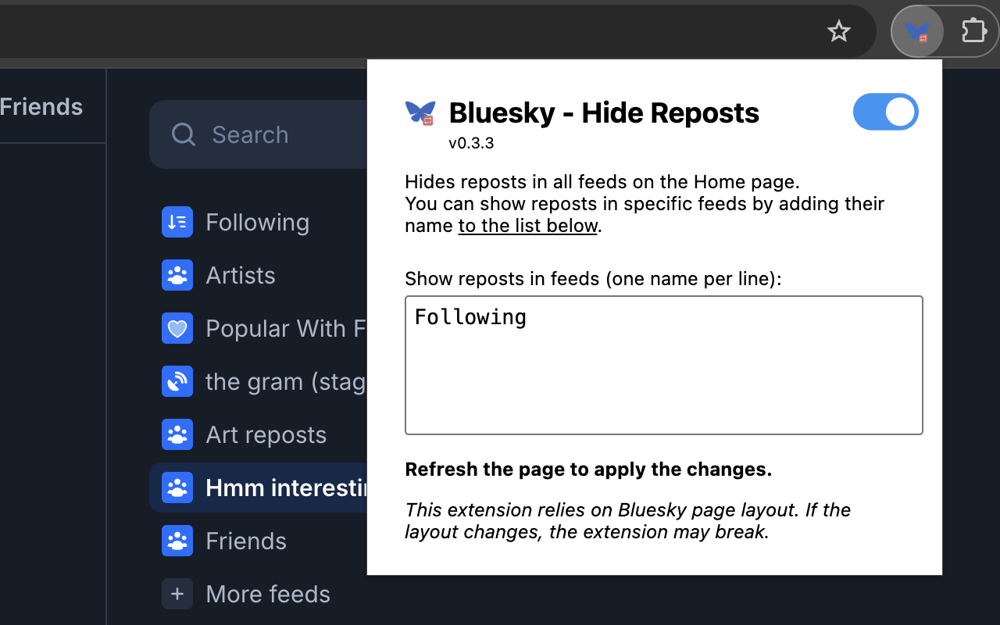

# Bluesky - Hide Reposts

## Chrome extension for hiding reposts in Bluesky lists

Chrome Web Store page:
https://chromewebstore.google.com/detail/bluesky-hide-reposts/dpilnfdphkebghgbgggdlnjdijdamnee

When enabled, hides reposts from the feeds on the Home page of Bluesky.

You can specify which feeds need to show reposts (by default, it's "Following").

*This extension relies on Bluesky page layout. If the layout changes, the extension may break*

## Source code

- `preload.js`- entry point script
- `src` folder - source code in Typescript
- `dist` folder - transpiled extension files, can be used for local installation

## Build process

- make sure you have `npm` installed
- run `npm install` (install dependencies) 
- run `npm run build` to create a fresh `dist` folder and an archive in `download` folder

## Local installation

If you prefer to install it locally:

1. Get folder with the extension. You can copy `dist` folder from the source code or download and unpack ZIP file from here: https://github.com/mg-wzl/bsky-custom-hidden-reposts/tree/main/download
2. Copy the folder with extension somewhere you prefer to keep it
3. In Chrome: install the extension using Developer Mode (see official Google instructions [here](https://developer.chrome.com/docs/extensions/mv3/getstarted/development-basics/#load-unpacked))
    - open "Extensions" ( `chrome://extensions/` )
    - enable Developer Mode
    - press "Load unpacked", chose the unpacked folder
    - disable Developer Mode
4. It's installed!

